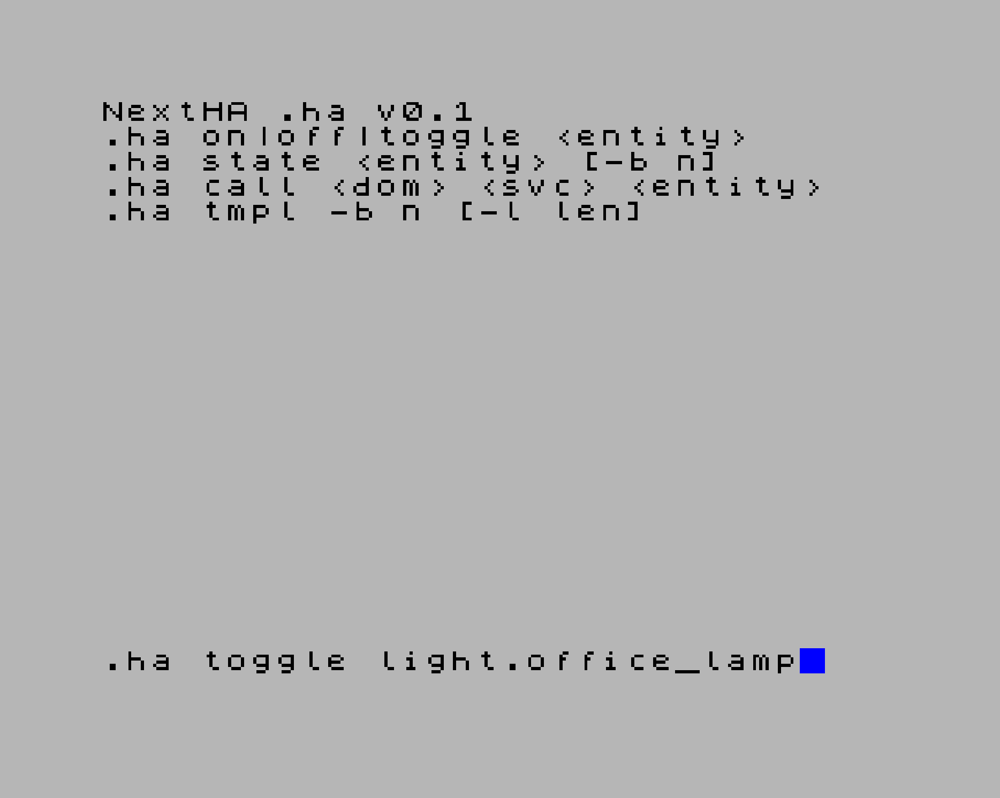

# NextHA

NextHA lets a ZX Spectrum Next control and read a Home Assistant (HA)
instance over Wi-Fi. It is two things built from one shared engine:

- **`.HA`** - a NextZXOS dot command you can type from NextBASIC (or a
  BASIC program can run for you) to call HA services and read entity
  state, with a simple bank protocol for moving larger results (like a
  rendered template) into a NextBASIC program.
- **`ha.lib`** - the C engine behind `.HA` (transport + HTTP + HA
  client), for z88dk C authors who want to talk to HA from their own
  program instead of shelling out to `.HA`.

`.HA` is built from the same engine sources that `ha.lib` packages;
there is one implementation.



## Hardware needed

- A ZX Spectrum Next running NextZXOS/esxdos, with an SD card.
- An ESP-01 Wi-Fi module fitted to the Next's UART, joined to a Wi-Fi
  network that can reach your Home Assistant instance.
- A Home Assistant instance reachable on that network over plain HTTP
  (v0.1 does not support HTTPS/TLS - see "Status / not yet" below).

## Install

1. A prebuilt `dist/HA` ships in this repository (rebuild it with
   `build.cmd` if you change the source).
2. Copy `dist\HA` to `/dot/ha` on the Next's SD card.
3. Copy `ha.cfg.example` (repo root; also in `dist\`) to `/sys/ha.cfg`
   on the SD card and edit `host`, `port` and `token` - the file is
   commented, and `docs/ha-cfg.md` explains every key and how to create
   a long-lived access token.

## First things to try

From NextBASIC, once `.ha` and `ha.cfg` are in place:

```
.ha toggle light.lounge
.ha state light.lounge
.ha tmpl -b 40
```

`toggle` calls a service with no output; `state` prints one entity's
state to the screen; `tmpl` renders the configured Jinja2 template
(defaulting to a list of lights/switches/fans/etc.) into memory bank
40, where a BASIC program can read it back - see
`examples/basic/ha-demo.bas` for a worked example, and `docs/cli.md`
for the full command reference.

## Documentation

- `docs/cli.md` - every `.HA` verb and option, the bank format, and
  exit/error behaviour.
- `docs/c-api.md` - the `ha.lib` C API, its no-heap/no-print rules, and
  how to build a program against it.
- `docs/ha-cfg.md` - the `ha.cfg` file format, limits, and how to
  create a Home Assistant long-lived access token.
- `docs/errors.md` - every error code, its `.HA` message, and its
  likely cause.

## Building from source

Requires [z88dk](https://z88dk.org) (this tree assumes it is installed
at `D:\ZXNextDev\z88dk`) and a MinGW `gcc` on `PATH` for the host test
suite.

Build `HA`, `ha.lib`, and the `dist/` packaging (headers + library +
binary) from the repository root:

```
build.cmd
```

Run the host-side unit tests (protocol/parsing logic, run under `gcc`
with a mocked transport - no hardware or emulator needed):

```
test\run_host_tests.cmd
```

Build the example C program (`examples/c/toggle.c`) against `dist/`:

```
examples\c\build.cmd
```

Build `hacli`, a PC command-line tool that speaks the same HTTP/HA
protocol over a real TCP socket, useful for testing against a live HA
instance without a Next:

```
tools\build_hacli.cmd
```

## Not yet implemented

- The tilemap client application
- Webhook path - NextHA only talks to HA's stock REST API.
- TLS/HTTPS - HA must be reachable on the LAN over plain HTTP.
- HTTP chunked transfer encoding (detected and rejected, not decoded).
- NextBASIC string-variable arguments to `.ha` (arguments are literal
  strings only).
- A `-x` flag to skip ESP re-initialisation on repeated dot
  invocations.

## Other ZX Spectrum Next projects

- [NextDAAD](https://github.com/absent42/NextDAAD) - DAAD text adventure interpreter and authoring kit.

## Licence

MIT - see `LICENSE`.
